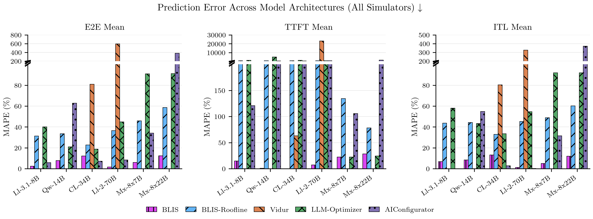
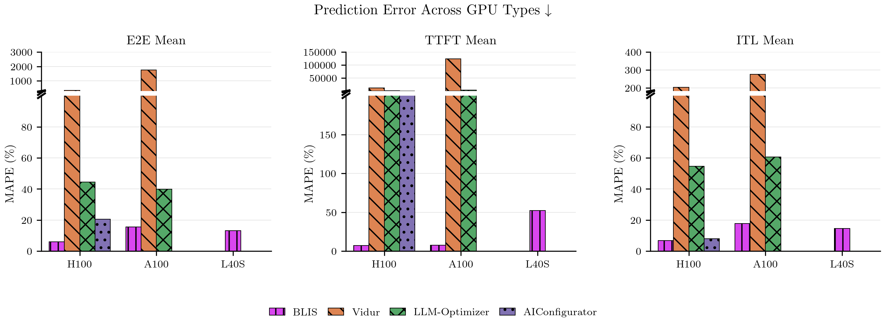
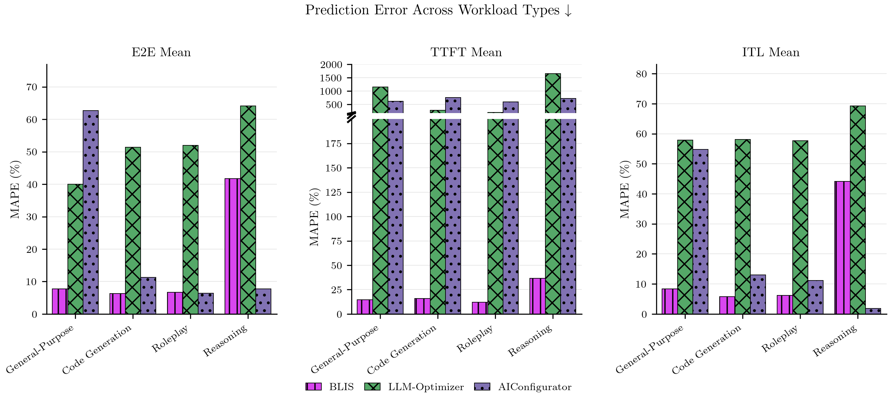
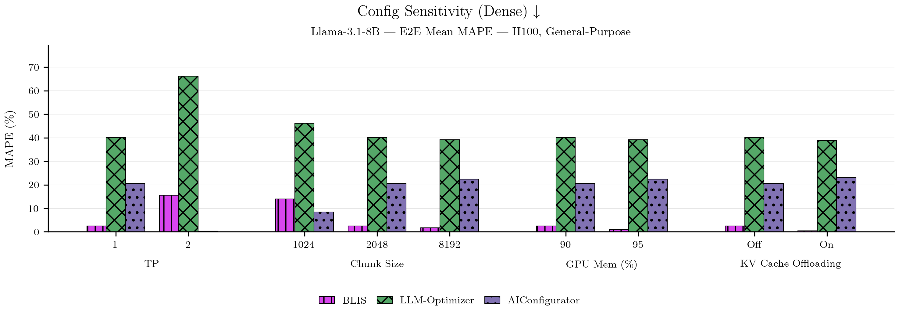
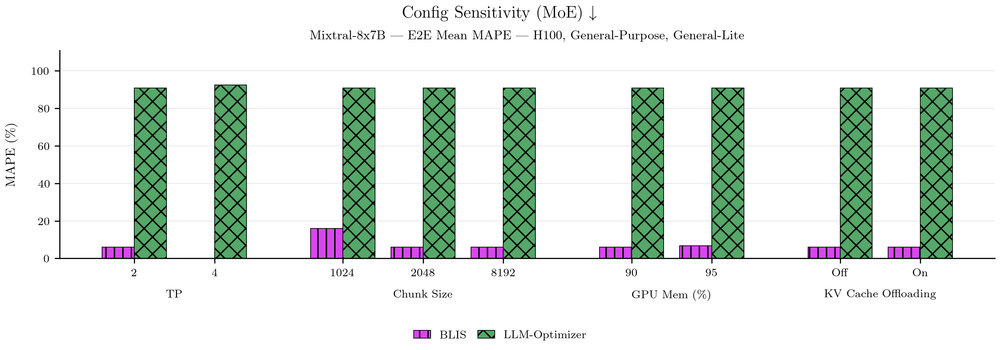
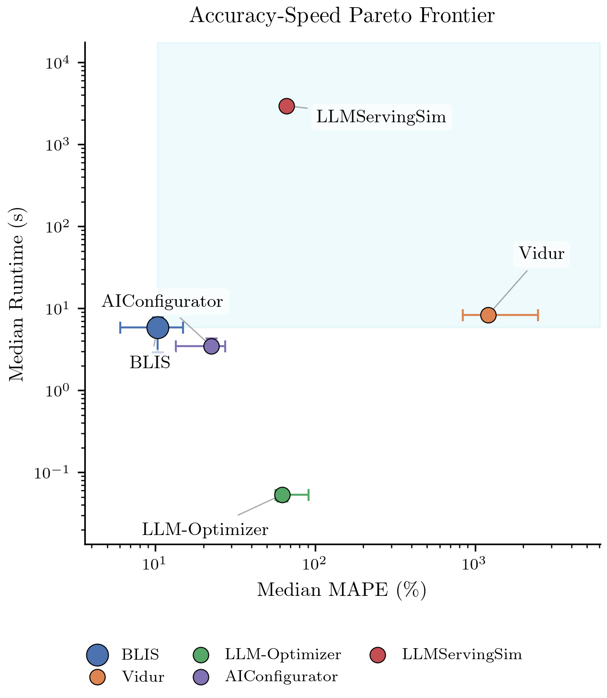

# Publication Figures

**Stage-level comparison methodology.** All workloads consist of multiple load stages at different request rates. BLIS and Vidur replay the full per-request trace in a single run; the adapter then splits output rows into stage buckets by cumulative arrival count. LLM-Optimizer and AIConfigurator are analytical estimators — for each stage they derive concurrency via Little's Law from the stage's request rate, then query the estimator at that concurrency.

---

### Figure 1: Prediction Error Across Model Architectures

MAPE of each simulator across 7 models on H100 with default serving configuration and general-purpose workload: Llama-3.1-8B, Qwen3-14B, CodeLlama-34B, Llama-2-70B (dense), Mixtral-8x7B, Mixtral-8x22B, and Llama-4-Scout-17B-16E (MoE/FP8). Vidur is limited to models it has pre-profiled (CodeLlama-34B, Llama-2-70B) and cannot simulate MoE architectures. AIConfigurator lacks MoE support and is restricted to H100 dense models. LLM-Optimizer cannot run Llama-4-Scout due to missing HuggingFace config fields.

---

### Figure 2: Prediction Error Across GPU Types

Median MAPE across models for three GPU types (H100, A100-80GB, L40S) with default configuration. No simulator supports L40S: Vidur and LLM-Optimizer lack an L40S device specification, and AIConfigurator has no L40S performance data. AIConfigurator is further limited to H100, having no A100 vLLM performance profiles. Vidur coverage on A100 is restricted to its pre-profiled models.

---

### Figure 3: Prediction Error Across Workload Types

Median MAPE for four workload types — general-purpose, code generation, roleplay, and reasoning — on H100 with default configuration. Aggregated over four models spanning the architecture space: Llama-3.1-8B (small dense), Qwen3-14B (medium dense), Llama-4-Scout-17B-16E (quantized MoE, FP8), and Mixtral-8x22B (large MoE). These were chosen to cover small-to-large parameter counts and both dense and mixture-of-experts architectures.

---

### Figure 4a: Config Sensitivity — Dense Model

MAPE under controlled single-parameter sweeps on a dense model (H100, general-purpose workload). Each group varies one serving parameter — TP, chunk size (max\_num\_batched\_tokens), GPU memory utilization, or KV cache offloading — while holding all others at baseline. LLM-Optimizer and AIConfigurator are roofline/analytical estimators that do not model chunk size, KV cache offloading, or GPU memory utilization; their bars remain constant across those sweeps. Vidur lacks a profile for this model and does not appear.

---

### Figure 4b: Config Sensitivity — MoE Model

Same controlled single-parameter sweeps as Figure 4a, applied to a MoE model (Mixtral-8x7B, H100, general-purpose workload), with expert parallelism (DP) as an additional swept dimension. Vidur cannot simulate MoE architectures. AIConfigurator excludes all MoE models. LLM-Optimizer runs but treats MoE as dense and is blind to chunk size, KV cache offloading, GPU memory utilization, and data parallelism.

---

### Figure 5: Accuracy vs. Speed Pareto Frontier

Median MAPE vs. median wall-clock runtime per simulator, aggregated across all experiments. Error bars show interquartile range. The shaded region marks the Pareto-dominated quadrant — simulators there are strictly worse on both accuracy and speed. All simulators are shown regardless of any exclusion flags applied to other figures.

---

### Table 1: Simulator Runtime Summary

| Simulator | Median Runtime (s) | Speedup vs. Real |
|---|---|---|
| Vidur | 127.1 | 9x |
| LLM-Optimizer | 0.1 | 23,754x |
| AIConfigurator | 3.3 | 360x |

Median runtime per simulator and speedup over real experiment execution (~1200s per experiment).
