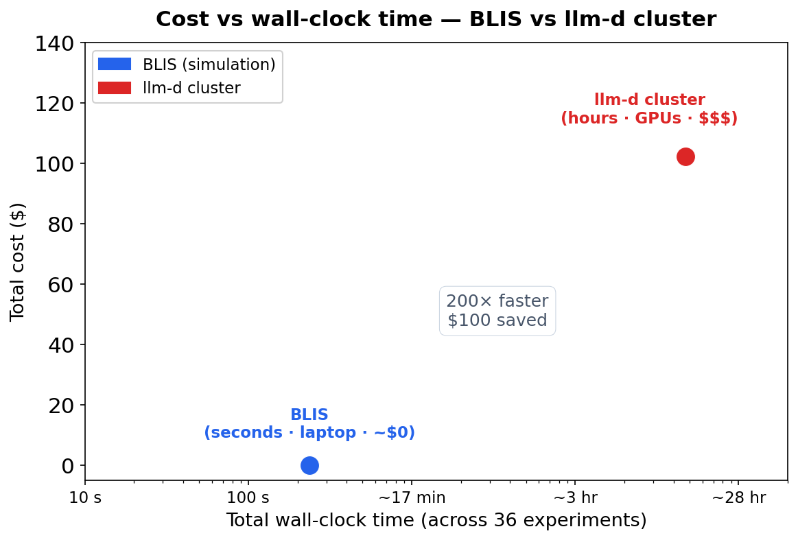

# Accuracy Figures

## Simulator Versions

| Simulator | Source | Commit/Version |
|-----------|--------|----------------|
| BLIS | [inference-sim](https://github.com/inference-sim/inference-sim) | `b05154c` |
| Vidur | [microsoft/vidur](https://github.com/microsoft/vidur) | `8383d29` |
| LLM-Optimizer | [bentoml/llm-optimizer](https://github.com/bentoml/llm-optimizer) | `bb82d22` |
| AIConfigurator | [aiconfigurator SDK](https://pypi.org/project/aiconfigurator/) | `0.8.0` |
| LLMServingSim | [casys-kaist/LLMServingSim](https://github.com/casys-kaist/LLMServingSim) | `baf0feb` |

## Ground Truth

All ground-truth measurements were collected using [inference-perf](https://github.com/kubernetes-sigs/inference-perf) on vLLM serving deployments across H100, A100-80GB, and L40S GPUs. For full details on the ground-truth collection methodology, cluster setup, and experiment matrix, see [inference-sim/inference-sim#598](https://github.com/inference-sim/inference-sim/discussions/598).

## Methodology Notes

- **BLIS variant.** "BLIS" refers to the `blis-trained-physics` adapter (learned alpha/beta coefficients + physics-based TP All-Reduce modeling).
- **Metrics.** All figures report summary-level MAPE (`stage_index = -1`), not per-stage.
- **Simulation types.** BLIS and Vidur replay full per-request traces. LLM-Optimizer and AIConfigurator are analytical (concurrency derived via Little's Law from ground-truth E2E). LLMServingSim is cycle-accurate.
- **Coverage gaps.** Vidur/AIConfigurator exclude MoE models. LLM-Optimizer approximates MoE as dense. AIConfigurator is H100-only. Only BLIS supports all hardware, workloads, and config parameters.

---

### Figure 1: Prediction Error Across Model Architectures (All Simulators)

MAPE of each simulator across 6 models on H100 with default serving configuration and general/general-lite workloads: Llama-3.1-8B, Qwen3-14B, CodeLlama-34B, Llama-2-70B (dense), Mixtral-8x7B, and Mixtral-8x22B (MoE). Three panels show E2E Mean, TTFT Mean, and ITL Mean MAPE respectively. BLIS achieves the lowest error across all models and metrics. Simulators absent from a model either lack a pre-built profile for that architecture (Vidur) or exclude MoE models entirely (Vidur, AIConfigurator). Vidur shows extremely high TTFT error (>10,000%) on models where it has profiles, likely due to prefill scheduling differences between its emulated scheduler and production vLLM.

---

### Figure 2: Prediction Error Across GPU Types

Median MAPE across models for three GPU types (H100, A100-80GB, L40S) with default configuration (each model's standard TP, no CPU KV cache offloading, 0.90 GPU memory utilization, max\_num\_batched\_tokens=2048, DP≤1) and general/general-lite workloads only. No non-BLIS simulator supports L40S. AIConfigurator is limited to H100. Vidur coverage varies by GPU due to per-model profiling requirements (only CodeLlama-34B and Llama-2-70B on A100). BLIS maintains single-digit E2E MAPE across all three GPU types.

---

### Figure 3: Prediction Error Across Workload Types

Median MAPE for four workload types — general-purpose, code generation, roleplay, and reasoning — on H100 with default configuration. Vidur is excluded from this figure due to limited workload coverage. BLIS shows consistent low error across all workload types, while analytical estimators show higher variation particularly on code generation and reasoning workloads.

---

### Figure 4a: Config Sensitivity — Dense Model

E2E Mean MAPE for individual config values under controlled single-parameter sweeps on Llama-3.1-8B (H100, general-purpose workload). Each group varies one serving parameter — TP, chunk size (max\_num\_batched\_tokens), GPU memory utilization, or KV cache offloading — while holding all others at baseline. BLIS achieves <5% E2E MAPE across nearly all config sweeps. Analytical estimators (LLM-Optimizer, AIConfigurator) do not accept chunk size, offloading, or memory utilization as inputs, so their predictions remain constant across those sweeps (see methodology). Vidur is absent as it lacks a Llama-3.1-8B profile.

---

### Figure 4b: Config Sensitivity — MoE Model

E2E Mean MAPE for individual config values under controlled single-parameter sweeps on Mixtral-8x7B (H100, general-purpose and general-lite workloads). Same parameter sweeps as Figure 4a (TP, chunk size, GPU memory utilization, KV cache offloading). Vidur and AIConfigurator exclude MoE architectures entirely. LLM-Optimizer runs using its dense approximation (~90% MAPE), demonstrating that ignoring expert routing leads to systematic overestimation. BLIS maintains <15% MAPE even under the challenging TP=4 configuration.

---

### Figure 5: Accuracy vs. Speed Pareto Frontier

Median MAPE vs. median wall-clock runtime per simulator on log-log axes, aggregated across all experiments without filtering. Error bars show interquartile range. BLIS achieves the best accuracy (~10% median MAPE) at moderate speed (~5.8s median runtime, 208× speedup). LLM-Optimizer is the fastest (0.1s, 22,679× speedup) but with higher error (~65% median MAPE). LLMServingSim is slower than real execution (353s median, 0.4× "speedup") while achieving ~65% median MAPE — comparable to LLM-Optimizer's accuracy at 3,500× the runtime. Vidur shows the highest median error (>1,000%) due to systematic TTFT overprediction.

---

### Figure 6: Cost vs. Wall-Clock Time — BLIS vs. llm-d Cluster

Total wall-clock time and estimated cost to run the full experiment suite (36 experiments). BLIS completes all simulations in ~200 seconds on a laptop at negligible cost. Running equivalent experiments on an llm-d GPU cluster requires ~28 hours of GPU time at ~$103 estimated cost. BLIS provides a 200× speedup and ~$100 savings per evaluation cycle, enabling rapid iteration during model serving configuration exploration.

---

### Table 1: Simulator Runtime Summary

| Simulator | Median Runtime (s) | Speedup vs. Real |
|---|---|---|
| BLIS | 5.8 | 208× |
| Vidur | 8.4 | 145× |
| LLM-Optimizer | 0.1 | 22,679× |
| AIConfigurator | 3.5 | 350× |
| LLMServingSim | 353.3 | 0.4× |

Median wall-clock runtime per simulator and speedup relative to real experiment execution (~1,200s per experiment). BLIS provides the best accuracy-speed tradeoff: 10× more accurate than LLM-Optimizer at only 58× slower, and orders of magnitude faster than LLMServingSim at comparable or better accuracy. LLMServingSim's cycle-accurate simulation is slower than running the actual serving experiment on hardware.
