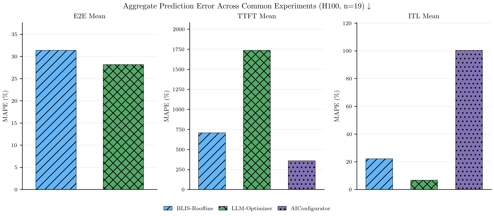

# Publication Figures

## Methodology Notes

**Ground truth data collection.** All ground truth measurements were collected using [inference-perf](https://github.com/kubernetes-sigs/inference-perf), which orchestrates vLLM serving experiments and captures per-request latency distributions and throughput metrics.

**Metrics compared.** All figures and tables report error metrics computed from **summary-level predictions** (aggregated across all load stages, `stage_index = -1` in results.csv). Per-stage metrics are excluded from the analysis to focus on overall experiment accuracy rather than individual load phase predictions.

**Trace replay vs. analytical estimation.** BLIS and Vidur replay the full per-request trace (with original inter-arrival times) in a single run; the adapter then splits output rows into stage buckets by cumulative arrival count. LLM-Optimizer and AIConfigurator are analytical estimators — for each stage they derive concurrency via Little's Law (L = λ × W) using the stage's request rate and the ground-truth mean E2E latency, then query the estimator at that concurrency. This means the concurrency input to analytical estimators is informed by observed performance, not purely predicted.

**Workload support.** BLIS natively supports multi-turn workloads via `enable_multi_turn_chat` in its workload spec. Vidur replays per-request traces, so multi-turn context is implicit in the actual token lengths. LLM-Optimizer and AIConfigurator only run on `shared_prefix` workloads — they use the configured fixed token lengths (question\_len + system\_prompt\_len, output\_len) rather than per-request actuals, and cannot model multi-turn conversational patterns.

**MoE approximations.** Vidur and AIConfigurator exclude MoE models entirely. LLM-Optimizer runs MoE models but approximates them as dense, hardcoding the feed-forward dimension to 4×hidden\_size and ignoring expert routing.

**vLLM serving parameter pass-through.** Only tensor parallelism (TP) is passed by all simulators. Batch chunk size (max\_num\_batched\_tokens) is passed only by Vidur. Data parallelism (DP) is passed only by Vidur (via num\_replicas). Precision (FP16/FP8) is passed by LLM-Optimizer and AIConfigurator but not Vidur (hardcoded FP16). CPU KV cache offloading and GPU memory utilization are not modeled by any non-BLIS simulator — experiments varying these parameters produce identical predictions. Note: MAPE may still vary across such sweeps because the ground-truth latency changes while the simulator's prediction stays constant, shifting the error ratio.

---

### Figure 0: Aggregate Comparison — Default Config

Median MAPE aggregated across 5 H100 experiments where BLIS-Roofline, LLM-Optimizer, and AIConfigurator all have data, using default vLLM serving configuration (each model's standard TP, no CPU KV cache offloading, 0.90 GPU memory utilization, max\_num\_batched\_tokens=2048, DP≤1) and general/general-lite workloads only. Aggregation treats each experiment as an independent data point — Qwen3-14B contributes two experiments (one general, one general-lite workload), while other models contribute one each. Shows three metrics: E2E Mean (BLIS and LLM-Optimizer only, since AIConfigurator does not report E2E), TTFT Mean (all three simulators), and ITL Mean (all three simulators). Experiments span four dense models at their standard TP values: Llama-3.1-8B (TP=1), Qwen3-14B (TP=1), CodeLlama-34B (TP=2), Llama-2-70B (TP=4). Default configs ensure that analytical simulators' baseline assumptions (GPU-only inference, standard memory utilization, standard batching) match the ground truth configuration. Filter criteria match Figure 2 (Hardware Portability) for consistency.

---

### Figure 1: Prediction Error Across Model Architectures

MAPE for individual experiments across 7 models on H100 with default serving configuration and general/general-lite workloads: Llama-3.1-8B, Qwen3-14B, CodeLlama-34B, Llama-2-70B (dense), Mixtral-8x7B, Mixtral-8x22B, and Llama-4-Scout-17B-16E (MoE/FP8). No aggregation across experiments — shows one experiment per model to reveal per-architecture variation. Simulators absent from a model either lack a pre-built profile for that architecture (Vidur) or exclude MoE models entirely (Vidur, AIConfigurator). LLM-Optimizer runs MoE models using its dense approximation (see methodology).

---

### Figure 2: Prediction Error Across GPU Types

Median MAPE across models for three GPU types (H100, A100-80GB, L40S) with default configuration (each model's standard TP, no CPU KV cache offloading, 0.90 GPU memory utilization, max\_num\_batched\_tokens=2048, DP≤1) and general/general-lite workloads only. No non-BLIS simulator supports L40S. AIConfigurator is limited to H100. Vidur coverage varies by GPU due to per-model profiling requirements.

---

### Figure 3: Prediction Error Across Workload Types

Median MAPE for four workload types — general-purpose, code generation, roleplay, and reasoning — on H100 with default configuration (each model's standard TP, no CPU KV cache offloading, 0.90 GPU memory utilization, max\_num\_batched\_tokens=2048, DP≤1). Aggregated across experiments from four models: Llama-3.1-8B (small dense), Qwen3-14B (medium dense), Llama-4-Scout-17B-16E (quantized MoE, FP8), and Mixtral-8x22B (large MoE). Coverage varies by simulator — Vidur and AIConfigurator exclude MoE models entirely; Llama-4-Scout may lack data from some simulators depending on available profiles.

---

### Figure 4a: Config Sensitivity — Dense Model

E2E Mean MAPE for individual config values under controlled single-parameter sweeps on a dense model (H100, general/general-lite workloads). No aggregation — each bar shows one experiment with a specific parameter value. Each group varies one serving parameter — TP, chunk size (max\_num\_batched\_tokens), GPU memory utilization, or KV cache offloading — while holding all others at baseline. Analytical estimators (LLM-Optimizer, AIConfigurator) do not accept chunk size, offloading, or memory utilization as inputs, so their predictions remain constant across those sweeps (see methodology). Vidur is absent when it lacks a profile for the selected model.

---

### Figure 4b: Config Sensitivity — MoE Model

E2E Mean MAPE for individual config values under controlled single-parameter sweeps on a MoE model (Mixtral-8x7B, H100, general/general-lite workloads). No aggregation — each bar shows one experiment with a specific parameter value. Same parameter sweeps as Figure 4a (TP, chunk size, GPU memory utilization, KV cache offloading), with expert parallelism (DP) as an additional swept dimension. Vidur and AIConfigurator exclude MoE architectures entirely. LLM-Optimizer runs using its dense approximation and does not model DP, chunk size, offloading, or memory utilization (see methodology).

---

### Figure 5: Accuracy vs. Speed Pareto Frontier

Median MAPE vs. median wall-clock runtime per simulator, aggregated across all experiments without filtering (includes all models, hardware types, workloads, and config parameters). Two-level aggregation: first, median MAPE per (simulator, experiment) to handle outliers; then, median and interquartile range (Q1, Q3) across experiments per simulator. Error bars show IQR. The shaded region marks the Pareto-dominated quadrant — simulators there are strictly worse on both accuracy and speed. All simulators are shown regardless of any exclusion flags applied to other figures.

---

### Table 1: Simulator Runtime Summary

| Simulator | Median Runtime (s) | Speedup vs. Real |
|---|---|---|
| BLIS-Roofline | 1.6 | 770x |
| Vidur | 9.9 | 121x |
| LLM-Optimizer | 0.1 | 23,094x |
| AIConfigurator | 3.3 | 363x |

Median wall-clock runtime per simulator and speedup relative to real experiment execution. BLIS-Roofline provides a middle ground between analytical speed (LLM-Optimizer, AIConfigurator) and simulation fidelity (Vidur).
