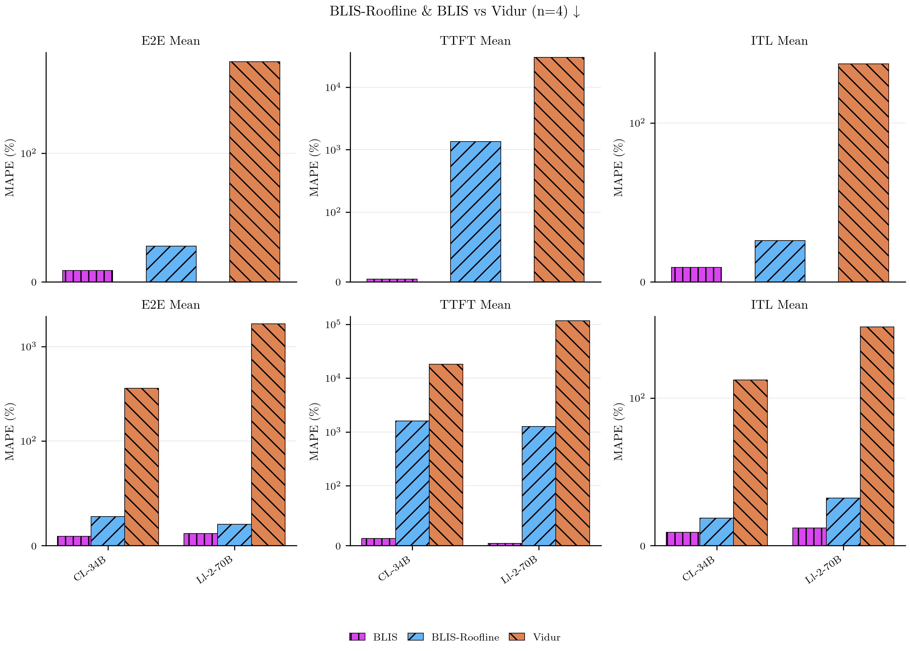
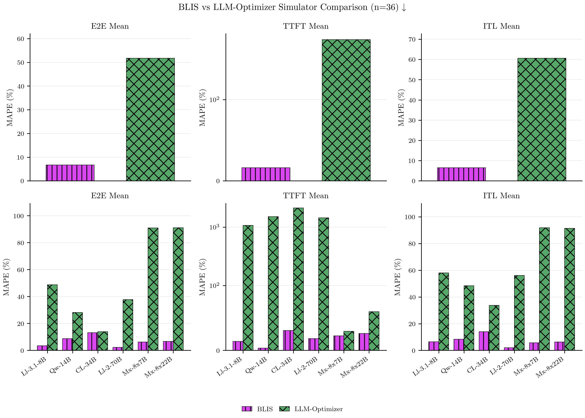
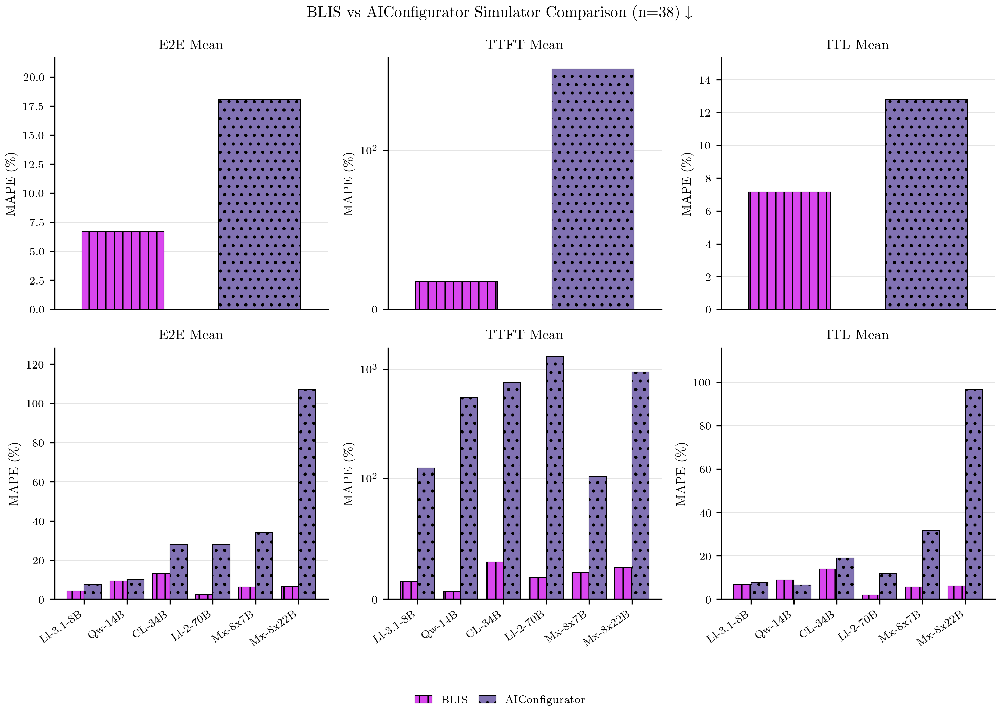

# Simulator Comparison Figures

## Overview

These figures provide pairwise head-to-head comparisons between BLIS-Roofline and each other simulator (Vidur, LLM-Optimizer, AIConfigurator). Each figure uses a **2×3 grid layout** combining aggregate and model-wise breakdowns across three latency metrics (E2E Mean, TTFT Mean, ITL Mean).

**Figure Layout:**
- **Top row (Aggregate):** 3 panels showing median MAPE aggregated across all experiments, models, configs, and workloads for E2E, TTFT, and ITL
- **Bottom row (Model Breakdown):** 3 panels showing median MAPE per model, aggregated across configs and workloads for E2E, TTFT, and ITL

**Data Filtering:** Each comparison includes only experiments where BOTH simulators have data (intersection of coverage). All configurations and workloads are included without filtering — no restrictions on default configs, safe flags, or workload types.

**Aggregation Method:** For aggregate panels, compute median MAPE across all data points. For model breakdown panels, compute median MAPE per model across all experiments/configs/workloads for that model.

---

## Comparison Figures

### BLIS-Roofline vs. Vidur

**Shared experiments:** 4 experiments
**Models:** CodeLlama-34b-Instruct-hf, Llama-2-70b-hf
**Workload:** general-lite only (Vidur only ran on this workload)
**Hardware:** H100 (Vidur lacks A100/L40S profiles in this dataset)

Vidur requires pre-built model profiles and currently only supports 3 models in the dataset. This comparison reflects Vidur's coverage limitations — it represents head-to-head accuracy on the small subset of experiments where both simulators have data. The limited model diversity (2 large dense models, both 70B/34B class) and single workload type mean this comparison does not generalize to the full workload/model space.

**Key observations:**
- Vidur's discrete-event simulation approach with vLLM scheduler emulation
- Limited to pre-profiled models (requires separate profiling run per architecture)
- Does not support MoE models
- Requires trace replay infrastructure

---

### BLIS-Roofline vs. LLM-Optimizer

**Shared experiments:** 38 experiments
**Models:** Qwen3-14B, CodeLlama-34b-Instruct-hf, Llama-2-70b-hf, Llama-3.1-8B-Instruct, Mixtral-8x22B-Instruct-v0.1, Mixtral-8x7B-v0.1
**Workload:** general, general-lite, codegen, roleplay (shared\_prefix workloads)
**Hardware:** H100, A100-80GB

LLM-Optimizer is an analytical roofline estimator that queries model configs from HuggingFace Hub and estimates latency using hardware compute/memory roofline models. It supports the broadest model coverage among non-BLIS simulators and includes MoE models (approximated as dense with 4×hidden\_size FFN dimension). This comparison represents head-to-head accuracy across a diverse set of dense and MoE models at various scales.

**Key observations:**
- Analytical estimator (no trace replay, no scheduling simulation)
- Supports both dense and MoE models (MoE approximated as dense)
- Requires only model config from HuggingFace Hub
- Limited to shared\_prefix workloads (cannot model multi-turn conversations)
- Does not model serving parameters beyond TP (no chunk size, CPU offload, GPU mem util, DP)

---

### BLIS-Roofline vs. AIConfigurator

**Shared experiments:** 19 experiments
**Models:** Qwen3-14B, CodeLlama-34b-Instruct-hf, Llama-2-70b-hf, Llama-3.1-8B-Instruct
**Workload:** general, general-lite, codegen, roleplay (shared\_prefix workloads)
**Hardware:** H100 only

AIConfigurator is an analytical estimator from the AIConfigurator SDK that focuses on H100 hardware and dense models. It excludes MoE architectures entirely and is limited to H100 (no A100/L40S support). This comparison represents head-to-head accuracy on dense models at various scales on H100 hardware.

**Key observations:**
- Analytical estimator (no trace replay, no scheduling simulation)
- Dense models only (no MoE support)
- H100 only (no multi-GPU-type portability)
- Limited to shared\_prefix workloads (cannot model multi-turn conversations)
- Does not model serving parameters beyond TP (no chunk size, CPU offload, GPU mem util, DP)

---

## LLMServingSim

**Note:** BLIS-Roofline vs. LLMServingSim comparison figure was not generated because there are insufficient shared experiments (fewer than 2 experiments with both simulators). LLMServingSim has extremely sparse coverage in the dataset (~1-2 experiments) due to its prohibitive runtime (hours per experiment). See the cluster deployment workflow in docs/cluster-deployment/ for details on running LLMServingSim separately.

---

## Methodology Notes

**Concurrency for analytical estimators:** LLM-Optimizer and AIConfigurator are analytical estimators that require a concurrency input. For each ground-truth load stage, concurrency is derived via Little's Law (L = λ × W) using the stage's request rate (λ) and the ground-truth mean E2E latency (W). This means the concurrency input is informed by observed performance, not purely predicted — see main figure\_captions.md for full methodology discussion.

**MAPE calculation:** All error metrics are computed as absolute percentage error: `|predicted - actual| / actual × 100`. Median MAPE is used for aggregation to handle outliers robustly.

**Stage filtering:** All comparisons use summary-level predictions (`stage_index = -1`) aggregated across all load stages, consistent with the main publication figures.
