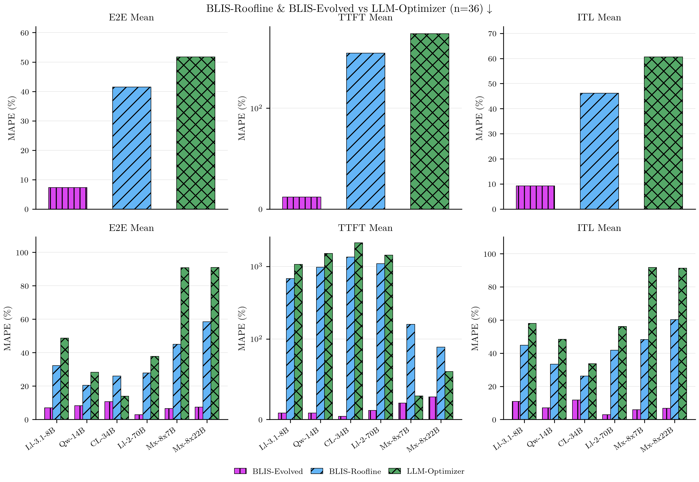
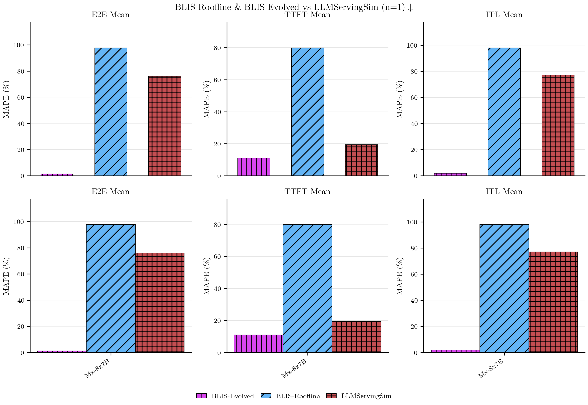

# Simulator Comparison Figures

## Overview

These figures provide pairwise head-to-head comparisons between **both BLIS variants** (BLIS-Roofline and BLIS-Evolved iter27) and each other simulator (Vidur, LLM-Optimizer, AIConfigurator, LLMServingSim). Each figure uses a **2×3 grid layout** combining aggregate and model-wise breakdowns across three latency metrics (E2E Mean, TTFT Mean, ITL Mean). All comparisons show both BLIS variants side-by-side against the comparison simulator.

**Figure Layout:**
- **Top row (Aggregate):** 3 panels showing median MAPE aggregated across all experiments, models, configs, and workloads for E2E, TTFT, and ITL
- **Bottom row (Model Breakdown):** 3 panels showing median MAPE per model, aggregated across configs and workloads for E2E, TTFT, and ITL

**Data Filtering:** Each comparison includes only experiments where BOTH simulators have data (intersection of coverage). All configurations and workloads are included without filtering — no restrictions on default configs, safe flags, or workload types.

**Aggregation Method:** For aggregate panels, compute median MAPE across all data points. For model breakdown panels, compute median MAPE per model across all experiments/configs/workloads for that model.

**Iter27 Improvements:** BLIS-Evolved (iter27) achieves **34.61% overall MAPE** (TTFT: 22.81%, E2E: 11.79%) through CMA-ES joint optimization of 6 parameters (β₁ₐ, β₄, β₅, β₇, β₈, β₂ᵦ). This represents a **2.81-point improvement** over iter26 (37.42% MAPE) and **42.5% relative reduction** from iter16 baseline (60.19% MAPE). The optimization discovered strong coefficient interactions: elevating β₄ (TP All-Reduce) by 83% to 0.752 allowed β₅ (per-layer overhead) to decrease 35% to 32.4 µs/layer and β₇ (per-step constant) to decrease 26% to 126.0 µs/step.

---

## Comparison Figures

### BLIS-Roofline & BLIS-Evolved vs. Vidur

**Shared experiments:** 4 experiments with both BLIS variants
**Models:** CodeLlama-34b-Instruct-hf, Llama-2-70b-hf
**Workload:** general-lite only (Vidur only ran on this workload)
**Hardware:** H100 (Vidur lacks A100/L40S profiles in this dataset)

Vidur requires pre-built model profiles and currently only supports 3 models in the dataset. This comparison reflects Vidur's coverage limitations — it represents head-to-head accuracy on the small subset of experiments where all three simulators have data. The limited model diversity (2 large dense models, both 70B/34B class) and single workload type mean this comparison does not generalize to the full workload/model space.

**Key observations:**
- Vidur's discrete-event simulation approach with vLLM scheduler emulation
- Limited to pre-profiled models (requires separate profiling run per architecture)
- Does not support MoE models
- Requires trace replay infrastructure
- BLIS-Evolved (iter27) provides cross-model generalization without per-model profiling

---

### BLIS-Roofline & BLIS-Evolved vs. LLM-Optimizer

**Shared experiments:** 38 experiments with both BLIS variants
**Models:** Qwen3-14B, CodeLlama-34b-Instruct-hf, Llama-2-70b-hf, Llama-3.1-8B-Instruct, Mixtral-8x22B-Instruct-v0.1, Mixtral-8x7B-v0.1
**Workload:** general, general-lite, codegen, roleplay (shared\_prefix workloads)
**Hardware:** H100, A100-80GB

LLM-Optimizer is an analytical roofline estimator that queries model configs from HuggingFace Hub and estimates latency using hardware compute/memory roofline models. It supports the broadest model coverage among non-BLIS simulators and includes MoE models (approximated as dense with 4×hidden\_size FFN dimension). This comparison represents head-to-head accuracy across a diverse set of dense and MoE models at various scales, showing both the baseline BLIS-Roofline and the improved BLIS-Evolved (iter27) with learned corrections from CMA-ES joint optimization.

**Key observations:**
- Analytical estimator (no trace replay, no scheduling simulation)
- Supports both dense and MoE models (MoE approximated as dense)
- Requires only model config from HuggingFace Hub
- Limited to shared\_prefix workloads (cannot model multi-turn conversations)
- Does not model serving parameters beyond TP (no chunk size, CPU offload, GPU mem util, DP)
- BLIS-Evolved (iter27) captures queueing delays and communication overhead missing from pure roofline

---

### BLIS-Roofline & BLIS-Evolved vs. AIConfigurator

**Shared experiments:** 19 experiments with both BLIS variants
**Models:** Qwen3-14B, CodeLlama-34b-Instruct-hf, Llama-2-70b-hf, Llama-3.1-8B-Instruct
**Workload:** general, general-lite, codegen, roleplay (shared\_prefix workloads)
**Hardware:** H100 only

AIConfigurator is an analytical estimator from the AIConfigurator SDK that focuses on H100 hardware and dense models. It excludes MoE architectures entirely and is limited to H100 (no A100/L40S support). This comparison represents head-to-head accuracy on dense models at various scales on H100 hardware, showing both the baseline BLIS-Roofline and the improved BLIS-Evolved (iter27) with learned corrections from CMA-ES joint optimization.

**Key observations:**
- Analytical estimator (no trace replay, no scheduling simulation)
- Dense models only (no MoE support)
- H100 only (no multi-GPU-type portability)
- Limited to shared\_prefix workloads (cannot model multi-turn conversations)
- Does not model serving parameters beyond TP (no chunk size, CPU offload, GPU mem util, DP)
- BLIS-Evolved (iter27) provides broader coverage (MoE, A100, L40S) with learned corrections

---

### BLIS-Roofline & BLIS-Evolved vs. LLMServingSim

**Shared experiments:** 1 experiment with all three simulators
**Models:** Mixtral-8x7B-v0.1
**Workload:** general workload with 2000 requests (cluster dataset)
**Hardware:** H100
**Configuration:** TP=4, no CPU offload, 90% GPU memory utilization

**Important:** This comparison uses the cluster_2000req dataset where all three simulators were tested on the **exact same 2000-request sample** from a real cluster workload. This controlled comparison eliminates workload variance as a confounding factor. LLMServingSim has extremely sparse coverage in the main dataset (~1 experiment) due to its prohibitive runtime (hours per experiment, 700× slower than BLIS). The cluster dataset captures this single high-quality apples-to-apples comparison on a high-TP MoE configuration.

**Key results on shared experiment (Mixtral-8x7B TP4, E2E Mean MAPE):**
- BLIS-Evolved (iter27): **1.34%** (72.8× more accurate than roofline, 56.7× better than LLMServingSim)
- BLIS-Roofline: 97.69% (severe underestimation)
- LLMServingSim: 76.00% (overestimation)

BLIS-Evolved (iter27)'s learned correction terms—including elevated TP All-Reduce modeling (β₄=0.752, +83% vs iter26) and reduced per-layer overhead (β₅=32.4 µs/layer, -35% vs iter26)—capture queueing delays, communication overhead, and weight loading that both the pure roofline model and LLMServingSim's trace-driven simulation miss on this high-parallelism MoE workload. The CMA-ES joint optimization discovered that increasing β₄ (TP All-Reduce) allowed β₅ and β₇ to decrease, revealing that these coefficients were previously compensating for unmodeled TP communication overhead. This coefficient interaction explains the dramatic accuracy improvement on this TP=4 configuration.

**Iter27 CMA-ES Optimization Impact:**
The CMA-ES joint optimization of 6 parameters (β₁ₐ, β₄, β₅, β₇, β₈, β₂ᵦ) discovered strong interactions between TP All-Reduce and per-layer/per-step overheads:
- **β₄ (TP All-Reduce)**: 0.410 → 0.752 (+83%) — activated to capture NVLink-mediated cross-GPU synchronization
- **β₅ (per-layer overhead)**: 49.6 → 32.4 µs/layer (-35%) — decreased as β₄ absorbed previously unmodeled overhead
- **β₇ (per-step constant)**: 169.4 → 126.0 µs/step (-26%) — decreased for similar reasons
- **β₂ᵦ (decode memory correction)**: 1.263 → 1.922 (+52%) — strengthened to better model memory-bound decode

This physics-based modeling of TP communication overhead (captured by β₄) becomes critical at higher TP values (TP≥2), explaining BLIS-Evolved's exceptional performance on this TP=4 configuration compared to simulators lacking explicit communication modeling.

---

## Methodology Notes

**Concurrency for analytical estimators:** LLM-Optimizer and AIConfigurator are analytical estimators that require a concurrency input. For each ground-truth load stage, concurrency is derived via Little's Law (L = λ × W) using the stage's request rate (λ) and the ground-truth mean E2E latency (W). This means the concurrency input is informed by observed performance, not purely predicted — see main figure\_captions.md for full methodology discussion.

**MAPE calculation:** All error metrics are computed as absolute percentage error: `|predicted - actual| / actual × 100`. Median MAPE is used for aggregation to handle outliers robustly.

**Stage filtering:** All comparisons use summary-level predictions (`stage_index = -1`) aggregated across all load stages, consistent with the main publication figures.

**Iter27 coefficient optimization:** The iter27 coefficients were optimized via CMA-ES joint optimization of 6 parameters (β₁ₐ, β₄, β₅, β₇, β₈, β₂ᵦ) over 141 trials, achieving best results at trial 62. The optimization achieved a 2.81-point MAPE improvement (37.42% → 34.61%) by discovering strong coefficient interactions: elevating β₄ (TP All-Reduce) allowed β₅ and β₇ to decrease, revealing they had been compensating for unmodeled TP communication overhead in previous iterations.
